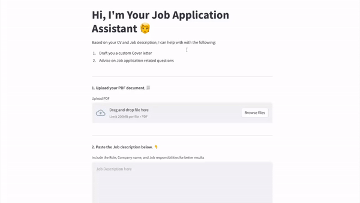

# Retrieval Augmented Generation (RAG) Job Application Assistant

Are you tired of the hassle of writing custom cover letters and answering application questions while searching for jobs? Look no further! The Retrieval Augmented Generation (RAG) Job Application Assistant is here to help you streamline the job application process.



📹 [Link](https://youtu.be/xm3Xse3HJ40)

## Features

- **Custom Cover Letter Generator**: The assistant can generate a personalized cover letter based on your CV and the job description.

- **Job Application Consultation**: Get expert advice on answering job application-related questions.

## Getting Started

## Method 1: Local/virtual environment

To get started with the RAG Job Application Assistant, follow these simple steps:

1. Clone this repository to your local machine.
2. Create an `.env` file inside the cloned repo based on the provided `env.example` file and add your OpenAI API key:

   ```bash
   OPENAI_API_KEY=<your_api_key_here>
   ```

3. Run the python command on the terminal

    ```python
    streamlit run app.py
    ```

## Method 2: Docker

1. Create your `.env` (Refer Method 1 for that)
2. Run the docker compose command

    ```bash
    docker-compose up
    ```

## Usage

To use the assistant, provide your CV and the job description, and it will assist you in generating a custom cover letter or answering application-related questions.

## Reference

1. LangChain [documentation](https://python.langchain.com/docs/use_cases/question_answering.html)
2. [RAG](https://python.langchain.com/docs/expression_language/cookbook/retrieval)
3. [Streamlit documentation](https://docs.streamlit.io/library/cheatsheet)
